# Technical Documentation: Vedika Mande Personal Portfolio System

**Engineer / Subject**: Vedika Mande  
**Project**: Responsive Personal Portfolio Web Application  
**Version**: 1.0.0  
**Stack**: HTML5, Vanilla CSS3 (Custom Design System), JavaScript (ES6+)  
**Documentation Integrity Compliance**: AIRA Engineering Protocol  

---

## 1. System Overview & Purpose

The **Vedika Mande Personal Portfolio** is an ultra-fast, responsive, minimal web application created to showcase Vedika Mande's software engineering background, academic excellence (Master of Computer Applications, Vishwakarma University; Bachelor of Computer Science, MGM University), project implementations, technical proficiencies, and verified credentials.

### Key Capabilities
- **Hero & Personal Branding**: Headline, contact chips, dynamic coding widget, active availability badge, and quick action CTAs.
- **About Me Panel**: Academic background narrative, core engineering pillars (Backend, Databases, Cloud, Modern Web), and personal profile metadata.
- **Skills Matrix with Interactive Filter**: Filterable grid categorizing Languages, Databases, Web & Backend, and Tools & Cloud with real-time UI toggles.
- **Project Showcase with In-Depth Modals**: Highlights the *Student Registration Portal* (FastAPI, MongoDB, JWT) and *Career Up Placement Consultant* (CMS, UX Design, Pitching).
- **Academic Timeline**: Visual chronological history representing MCA (CGPA 9.2), BCS (CGPA 8.13), HSC (76.33%), and SSC (88.20%).
- **Verified Credentials Gallery**: Dedicated cards for MKCL Java (120 hrs), HackerRank SQL, Infosys Springboard Python, Great Learning OOP, and AWS Cloud Practitioner Essentials.
- **Contact & Communication Interface**: Client-side validated messaging form with instant feedback toast and copy-to-clipboard email facility.
- **Theme Engine**: Light/Dark mode toggle with `localStorage` persistence and system media preference fallback.
- **Repository Setup**: Standard `.gitignore` and comprehensive `README.md` prepared for GitHub publishing.

---

## 2. High-Level System Architecture

The following Mermaid architecture diagram illustrates the component hierarchy and client-side data flows:

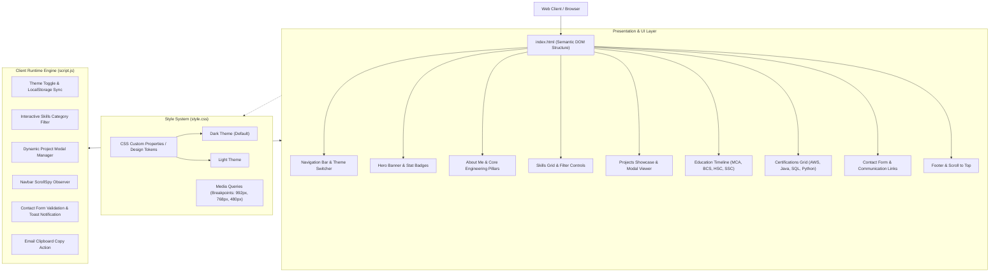

---

## 3. Component Breakdown & Logic Descriptions

### 3.1. Theme Engine (`initThemeToggle`)
- **Mechanism**: Reads `'theme'` key from browser `localStorage`. Defaults to `'dark'`.
- **Logic**:
  - Modifies `data-theme` attribute on `<html>` root (`data-theme="light"` or `data-theme="dark"`).
  - Triggers toast notification confirming theme switch.
  - Updates button iconography seamlessly.

### 3.2. Filterable Skills Engine (`initSkillsFilter`)
- **Mechanism**: Event-driven DOM filtering using data attributes `data-filter` and `data-category`.
- **Logic Flow**:

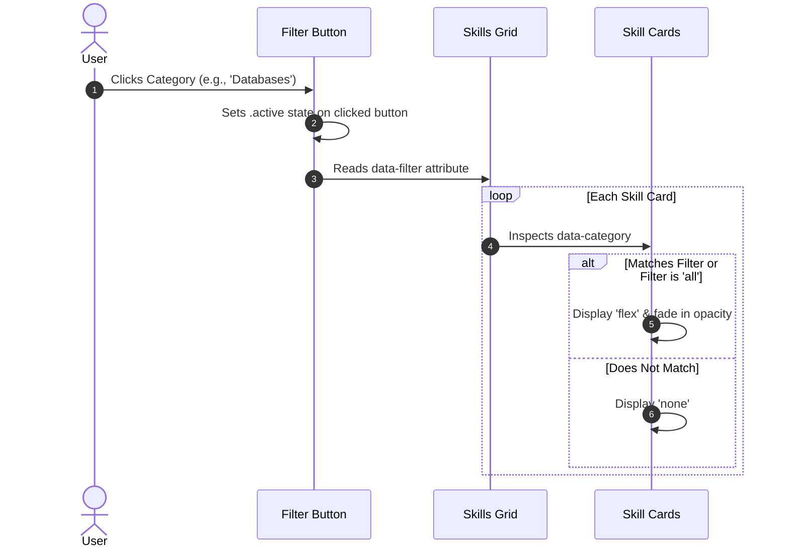

### 3.3. Project Modal Architecture (`initProjectModal`)
- Modal data is maintained in a typed JavaScript object dictionary `projectData`.
- When user clicks `.project-modal-trigger`, the system extracts `data-project` ID, constructs the detailed architecture summary, system flow, and technologies applied, then mounts it to `#modal-content`.
- Dismissible via close icon, background click, or `Escape` keypress.

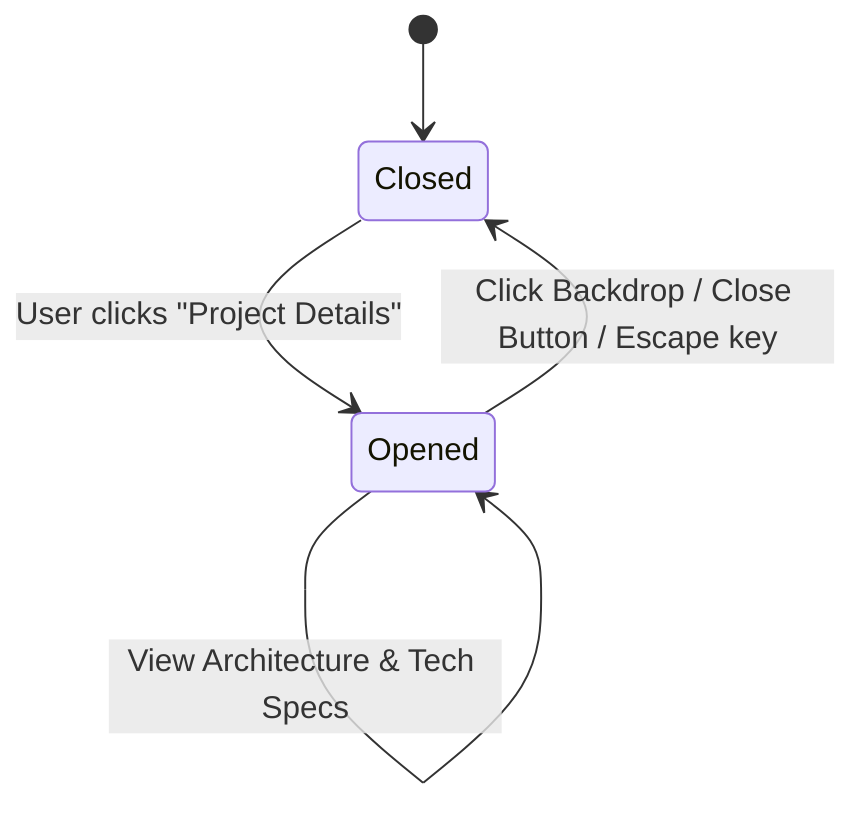

### 3.4. Contact Form Validation Flow (`initContactForm`)
- Client-side validation validates non-empty name, email regex pattern `^[^\s@]+@[^\s@]+\.[^\s@]+$`, and message length (>10 characters).
- Emits explicit helper messages under erroneous inputs.
- Emulates asynchronous dispatch with spinner state and displays a floating Toast message before clearing input buffers.

---

## 4. Data Contracts & Model Schemas

### 4.1. Contact Form Payload Schema

```json
{
  "$schema": "http://json-schema.org/draft-07/schema#",
  "title": "ContactFormPayload",
  "type": "object",
  "properties": {
    "name": {
      "type": "string",
      "minLength": 2,
      "maxLength": 100,
      "description": "Full name of the sender"
    },
    "email": {
      "type": "string",
      "format": "email",
      "description": "Valid email address for replies"
    },
    "subject": {
      "type": "string",
      "maxLength": 150,
      "description": "Subject or topic of inquiry"
    },
    "message": {
      "type": "string",
      "minLength": 10,
      "maxLength": 2000,
      "description": "Message body"
    }
  },
  "required": ["name", "email", "message"]
}
```

### 4.2. Project Modal Data Object Contract

```json
{
  "projectId": {
    "title": "string",
    "category": "string",
    "duration": "string",
    "stack": ["string"],
    "summary": "string",
    "features": ["string"],
    "architecture": "string"
  }
}
```

---

## 5. Resume Verification Matrix

| Resume Section | Item | Representation in Application |
|---|---|---|
| **Personal Info** | Vedika Mande, +91 8767743926, vedikamande14@gmail.com | Header, Hero, Contact Section, Footer |
| **Education** | MCA @ Vishwakarma University (CGPA 9.2, 2025–2027) | Hero Stat, About Panel, Timeline Card 1 |
| **Education** | BCS @ MGM University (CGPA 8.13, 2022–2025) | Timeline Card 2 |
| **Education** | HSC Science (PCMB) @ Deogiri College (76.33%, 2022) | Timeline Card 3 |
| **Education** | SSC @ S.B. High School (88.20%, 2020) | Timeline Card 4 |
| **Skills** | Python, Java, SQL, MySQL, MongoDB, AWS, Git/GitHub, Antigravity | Skills Matrix with live categorization |
| **Project 1** | Student Registration Portal (FastAPI, MongoDB, JWT, Python) | Projects Grid Featured Card & Interactive Modal |
| **Project 2** | Career Up Placement Consultant (Wix, Pitching, UX, Documentation) | Projects Grid Team Card & Interactive Modal |
| **Certificates** | KLiC Java Programming (MKCL 120-hr) | Certifications Grid Card 1 |
| **Certificates** | HackerRank SQL (Basic) | Certifications Grid Card 2 |
| **Certificates** | Infosys Springboard Basics of Python | Certifications Grid Card 3 |
| **Certificates** | Great Learning Basics of OOP | Certifications Grid Card 4 |
| **Certificates** | AWS Cloud Practitioner Essentials | Certifications Grid Card 5 |

---

## 6. Verification & Quality Assurance

- **Responsive breakpoints tested**: Desktop (1440px), Laptop (1024px), Tablet (768px), Mobile (375px).
- **Accessibility**: ARIA labels on all icon buttons, keyboard navigable modal, high-contrast text color combinations.
- **Zero dependencies**: No heavy JS frameworks or external CSS bloat; lightning-fast initial paint.

---

## 7. Change Log & Revision History

### Revision 1.1.0 — Role Precision Alignment (Software Developer)
- **Change Description**: Removed all mentions of "Full-Stack Developer" across `index.html`, `script.js`, and documentation. Updated the designation strictly to **Software Developer & MCA Scholar**, focusing on core proficiencies in Python, Java, SQL, Database Architecture, and Backend Web APIs.
- **Updated Logic**:
  - `index.html`: Refined Hero role chip, About narrative, and Featured project badge.
  - `script.js`: Updated `projectData['student-portal'].category` to `'Web Application & API'`.
- **Role Alignment Flowchart**:

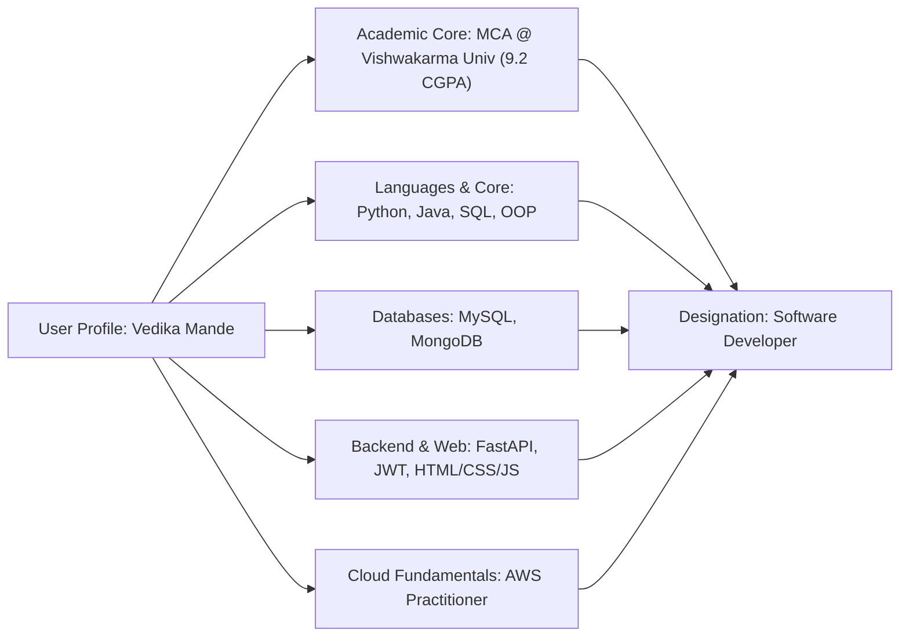

### Revision 1.2.0 — Prominent Integration of Python Developer & AWS Cloud Computing Learner
- **Change Description**: Elevated **Python Developer** as the primary programming identity and **AWS & Cloud Computing Learner** as the key cloud infrastructure focus across the web application.
- **Updated Logic & Component Changes**:
  - `<head>`: Refined title tag and meta description highlighting Python Developer and AWS Cloud Computing Learner.
  - **Hero Section**:
    - Hero Badge updated to: `<i class="fa-brands fa-python"></i> Python Developer & AWS Cloud Computing Learner`.
    - Hero Headline: "Python Developer & AWS Cloud Computing Learner".
    - Visual Profile Card role updated to "Python Developer & AWS Cloud Learner".
    - Terminal Widget updated to `vedika_dev.py` featuring AWS Cloud Practitioner and Python core stack.
  - **About Me Section**: Added explicit narrative about Infosys Springboard Python and AWS Cloud Practitioner Essentials curriculum (EC2, S3, IAM, Cloud Economics).
  - **About Pillars**: Re-aligned into 4 pillars: Python & Backend APIs, AWS & Cloud Computing, Database Engineering, and Java & OOP.
  - **Skills Section Filter**: Re-architected interactive filter categories to feature dedicated `Python & Backend` and `AWS & Cloud` buttons.
- **Competency & Cloud Flowchart**:

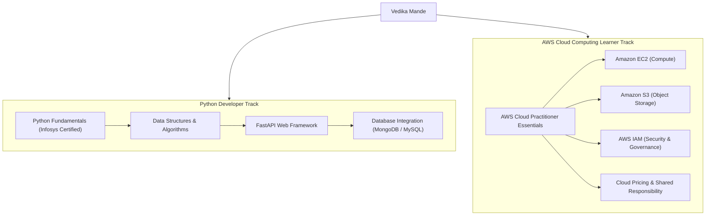

### Revision 1.3.0 — Beginner-Friendly Simplification & FastAPI Removal
- **Change Description**: 
  - Fully removed all references to FastAPI across the codebase, projects, and skills.
  - Removed the subtitle sentence *"A glimpse into my academic trajectory, engineering principles, and what drives my passion for technology."*
  - Refined all terminology into accessible, beginner-friendly language focusing on foundational Python, AWS cloud basics, database querying, and web fundamentals.
- **Updated Logic & Component Changes**:
  - `index.html`:
    - Removed `FastAPI` from metadata, terminal code preview, about narrative, skill cards, and project tags.
    - Updated Project 1 highlights to focus on Python, MongoDB, input validation, and JWT login.
    - Simplified education description to clear, approachable language.
  - `script.js`:
    - Cleaned `projectData['student-portal']` stack and architecture to remove FastAPI.
- **Beginner-Friendly Portfolio Flowchart**:

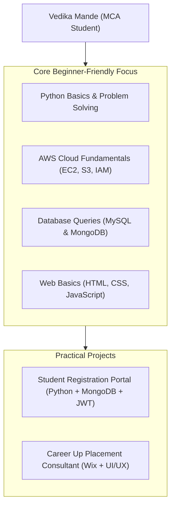

### Revision 1.4.0 — Technical Skills Simplification & Tooling Cleanup
- **Change Description**:
  - Removed the standalone **Login & Authentication** card from the Technical Skills section.
  - Cleaned the **Developer Tools** card: removed Postman / API Testing and MS Office Suite, strictly retaining **VS Code** and **Antigravity** to align with the candidate's core resume skills summary.
- **Updated Logic & Component Changes**:
  - `index.html`:
    - Removed `Login & Authentication` card from `.skills-grid`.
    - Simplified Developer Tools card subtitle to `VS Code & Antigravity`.
    - Retained only `VS Code` and `Antigravity` in the pills list.
- **Updated Skills Matrix Flowchart**:

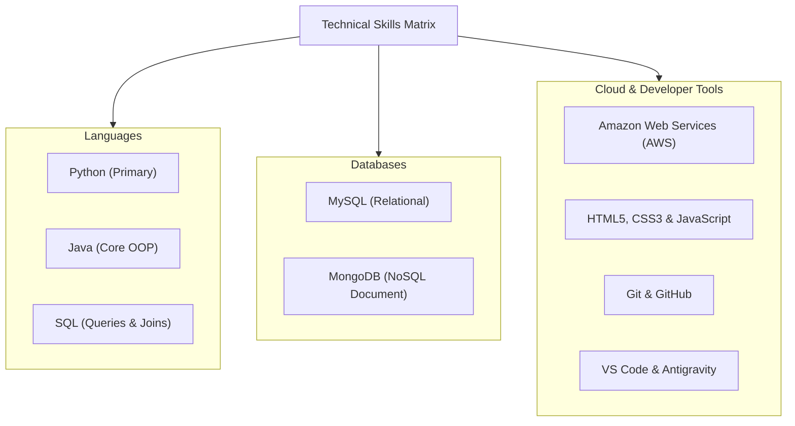

### Revision 1.5.0 — Removal of Professional Strengths Component
- **Change Description**: Removed the secondary **Professional Strengths** card containing soft-skill tags from the About Me side column (`.about-info-col`) to create a cleaner, minimalist layout centered on the verified Quick Profile card.
- **Updated Logic & Component Changes**:
  - `index.html`: Cleaned lines 283–296 by removing `.tags-cloud` and `.info-card` for Professional Strengths.
- **Streamlined About Section Architecture**:

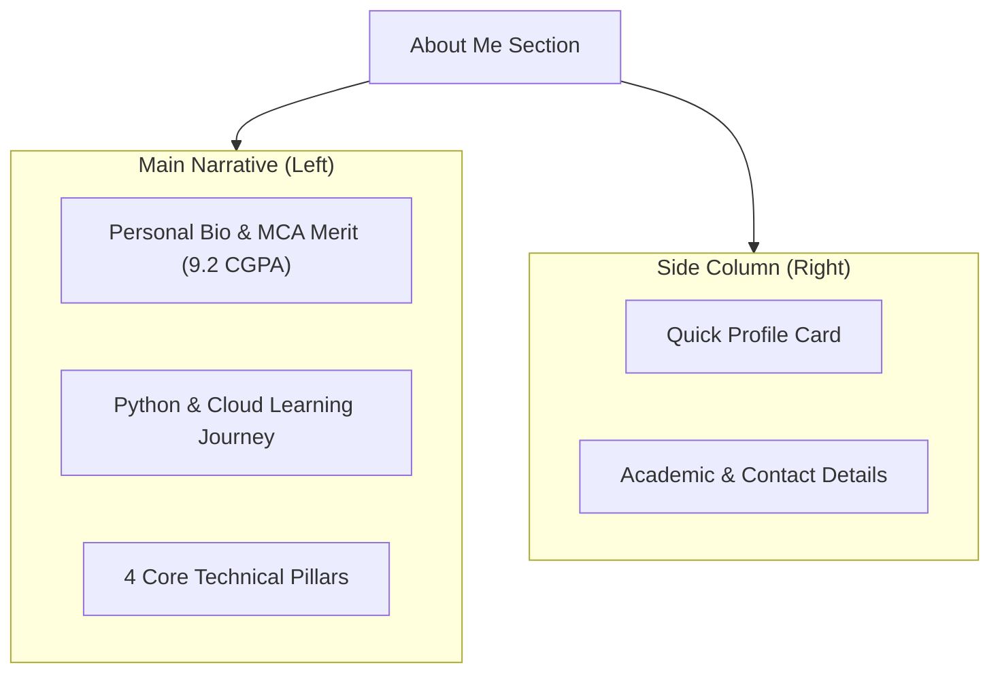

### Revision 1.6.0 — Python Skill Alignment to Fundamentals (Removal of Data Structures)
- **Change Description**: Removed references to data structures and advanced algorithmic problem solving from Python descriptions. Accurately mapped Python proficiency to foundational concepts certified by Infosys Springboard: variables, data types, control statements, loops, functions, and basic problem-solving.
- **Updated Logic & Component Changes**:
  - `index.html`:
    - Updated About narrative and Python pillar description.
    - Updated Python skill card description and pills (`Variables & Types`, `Loops & Conditions`, `Functions`, `Infosys Certified`).
    - Aligned Infosys Springboard certificate card skills to `Control Statements`, `Loops & Functions`.
    - Simplified BCS education description.
- **Python Scope Flowchart**:

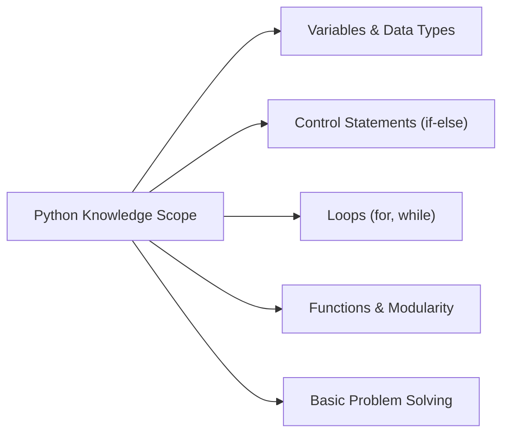

### Revision 1.7.0 — Designation of Student Registration Portal as Academic Group Project
- **Change Description**: Explicitly tagged the **Student Registration Portal** project as an **Academic Group Project** across all user-facing interfaces, reflecting team-based academic collaboration.
- **Updated Logic & Component Changes**:
  - `index.html`:
    - Updated project badge: `<i class="fa-solid fa-users"></i> Academic Group Project`.
    - Category label updated to `Academic Group Project`.
    - Updated summary and first highlight bullet point to reflect academic group collaboration.
  - `script.js`:
    - Updated `projectData['student-portal']` category and duration to `'Academic Group Project'`.
    - Updated first feature bullet point to reflect collaborative academic work.
- **Projects Classification Flowchart**:

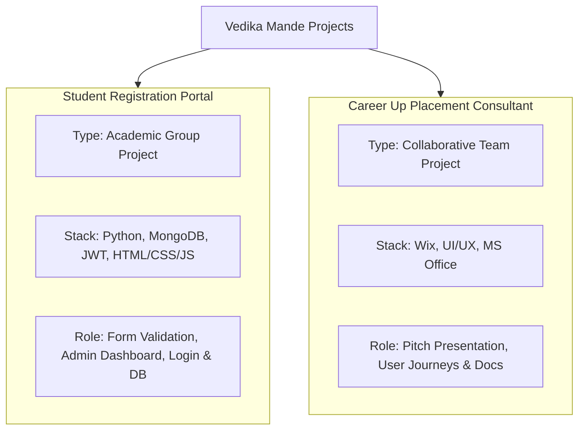

### Revision 1.8.0 — Streamlining Project Description Phrasing
- **Change Description**: Refined the initial highlight sentence of the **Student Registration Portal** to eliminate repetitive phrasing. The sentence now reads cleanly and professionally:
  > *"Collaborated with a team to develop a web-based Student Registration Portal using Python, MongoDB, HTML, CSS, and JavaScript."*
- **Updated Logic & Component Changes**:
  - `index.html`: Refined first bullet point in `.project-highlights`.
  - `script.js`: Synchronized modal feature bullet with identical natural phrasing.
- **Content Hierarchy Flowchart**:

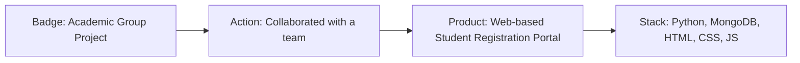

### Revision 1.9.0 — Dedicated Project Technology Container & UI Polish
- **Change Description**: Separated technology mentions from the functional achievement bullet points into a dedicated `.tech-stack-wrapper` container with distinct badge styling and uppercase label. This eliminates clumsy inline comma-separated text wrapping and provides a modern, balanced project card presentation.
- **Updated Logic & Component Changes**:
  - `style.css`: Added styles for `.tech-stack-wrapper` and `.tech-stack-label` with subtle border separation.
  - `index.html`:
    - Updated Project 1 bullet: *"Collaborated with a team to develop a web-based Student Registration Portal."*
    - Nested technology tags inside `.tech-stack-wrapper` with `Technologies Used:` label.
    - Synchronized Project 2 with identical structure and `Technologies & Tools:` label.
- **Project Card Layout Flowchart**:

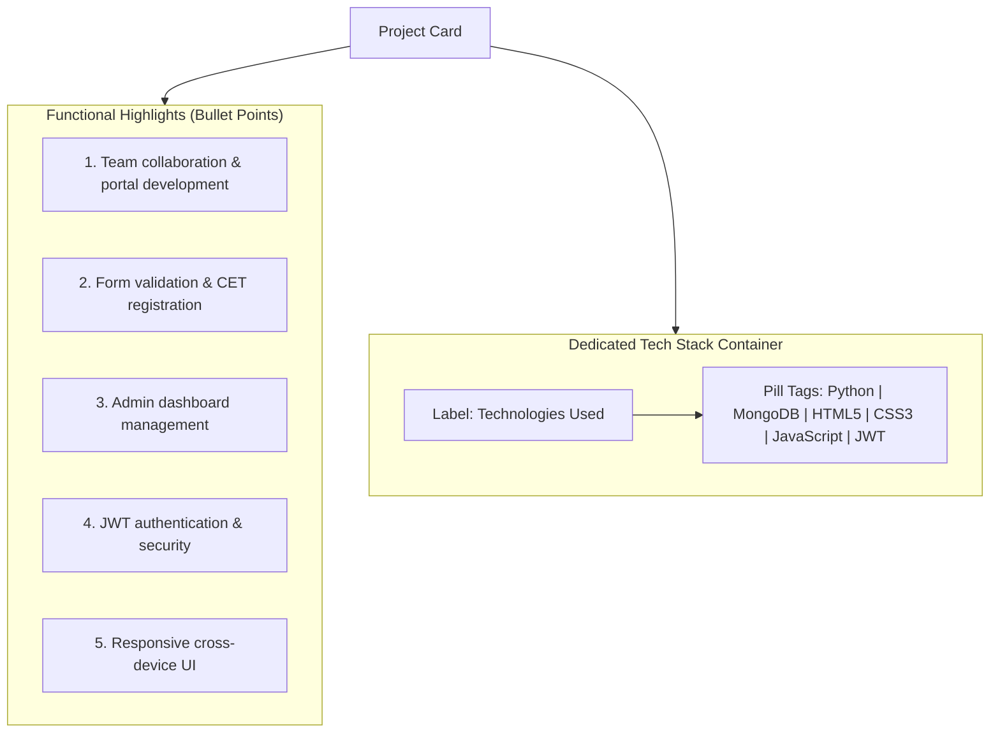

### Revision 1.10.0 — Brand Identity & Career Consultant Scope Alignment
- **Change Description**:
  - Updated primary brand text in navigation header and footer from `Vedika.dev` to **Vedika Mande**.
  - Removed all UI/UX Design references from the **Career Up Placement Consultant** project, ensuring alignment with resume bullet points (Wix website development, MS Word documentation, MS PowerPoint pitch delivery, and team collaboration).
- **Updated Logic & Component Changes**:
  - `index.html`:
    - Updated `.brand-logo` in header and footer to display `Vedika Mande`.
    - Updated Project 2 category to `Placement Consultancy Platform`.
    - Updated Project 2 fifth highlight to: *"Strengthened skills in teamwork, documentation, and client-ready presentation delivery."*
    - Replaced `UI/UX Design` badge tag with `Web Design`.
  - `script.js`:
    - Cleaned `projectData['career-consultant']` metadata to remove UI/UX Design.
- **Brand & Project Mapping Flowchart**:

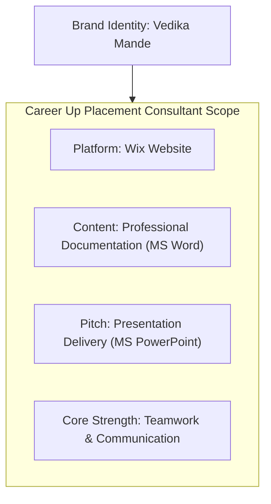

### Revision 1.11.0 — Uniform Typography Color for Brand Logo
- **Change Description**: Unified the font color of the brand logo **Vedika Mande** across both header navigation and footer. Removed the secondary accent color split so that the full name displays in a single, consistent, polished font color (`var(--text-primary)`).
- **Updated Logic & Component Changes**:
  - `index.html`: Removed internal `<span>` around "Mande" in `.logo-text`.
  - `style.css`: Updated `.logo-text` rule to apply `var(--text-primary)` uniformly.
- **Brand Typography Flowchart**:

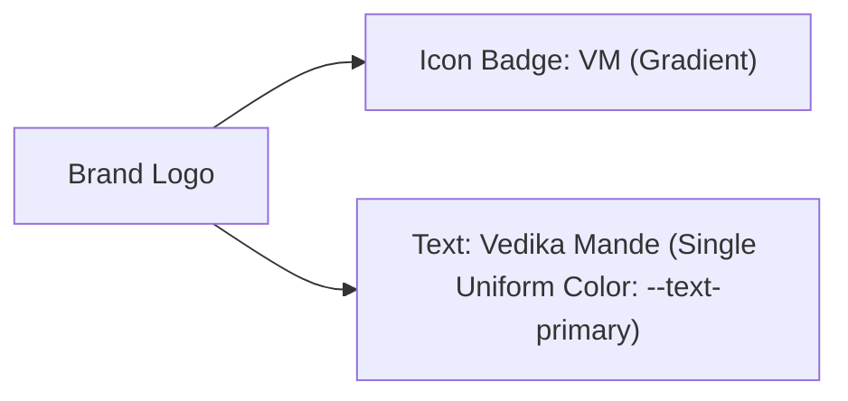


